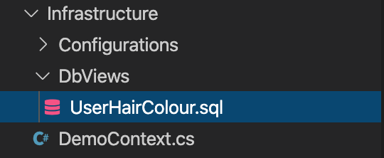

# MigrationlessViews

Run Dotnet Core views without them being migrated to the database. 

The idea behind the project is to be able to create views without having to add them to the database through migrations. This will make maintaining views faster and easier. This style of doing views will mean that the Sql files will be in source control. 

This will enable views to be used in unit tests without mocking. 

The package is available from [nuget](https://www.nuget.org/packages/MigrationlessViews/)

## Configuring the views

To use the migrationless views you will need to include the project on the service collection during startup

```
services.AddDbViews();
```

The database view provider will need to be injected into the database context.

```
    public class DemoContext : DbContext
    {
        public readonly DbViewProvider _viewProvider;

        public DemoContext(DbContextOptions<DemoContext> options, DbViewProvider viewProvider)
                : base(options)
        {
            _viewProvider = viewProvider;
        }
```

This will allow views to be used on the database.

## How to set up a view

The first thing to do when setting up a view is to create a class which inherits `IView`. For this example I have created a view to merge two entities (couldnt think if a better example to this).

```
    public class UserHairColour : IView
    {
        public string FirstName { get; set; }

        public string LastName { get; set; }

        public string HairColour { get; set; }
    }
```

This class needs to match the output of the view.

Create a configuration for the entity which sets the value as `HasNoKey()`. This will stop the migration builder from creating a table for the views.

```
    public class UserHairColourConfig : IEntityTypeConfiguration<UserHairColour>
    {
        public void Configure(EntityTypeBuilder<UserHairColour> builder)
        {
            builder.HasNoKey();
        }
    }
```

NOTE: In future versions i'm hoping to remove the need for adding this per entity.

On the database context. Add the entity, and initialise the view with the view provider.

```
        public IQueryable<UserHairColour> UserHairColours => _viewProvider.DbView<UserHairColour>();

```

The final thing to do is to create the Sql file for the view. This needs to have the same name as the entity.



The Sql file doesnt want to contain the CREATE VIEW, it just needs to be the query. For Example

```
WITH
    HairCte
    AS
    (
        SELECT
            id
            ,Colour
        FROM
            dbo.HairColours
    )
,UserCte
    AS
    (
        SELECT
            id
            ,FistName
            ,LastName
            ,HairColourId
        FROM
            Users
    )
SELECT
    u.FistName AS FirstName
    ,u.LastName
    ,h.Colour AS HairColour
FROM
    UserCte u
    INNER JOIN HairCte h
    ON h.Id = u.HairColourId
```
